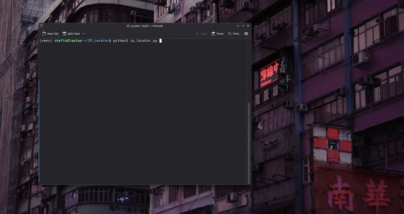

# 🌍 IP Locator

A simple and clean Python tool to fetch detailed information about any IP address using the ipinfo API.

---

## ✨ Features

* 🌐 Get IP location (City, Region, Country)
* 📡 Detect ISP / Organization
* 🧭 Coordinates (Latitude & Longitude)
* 🕒 Timezone information

---

## 📸 Demo

<p align="center">
  
</p>


---

## 📦 Requirements

Install dependencies using:

```bash
pip install -r requirements.txt
```

---


## 🚀 Usage

Run the script:

```bash
python3 ip_locator.py
```

Enter an IP address when prompted:

```
Enter IP address: 8.8.8.8
```

---


## ⭐ Support

If you found this useful, consider giving the repo a star ⭐
